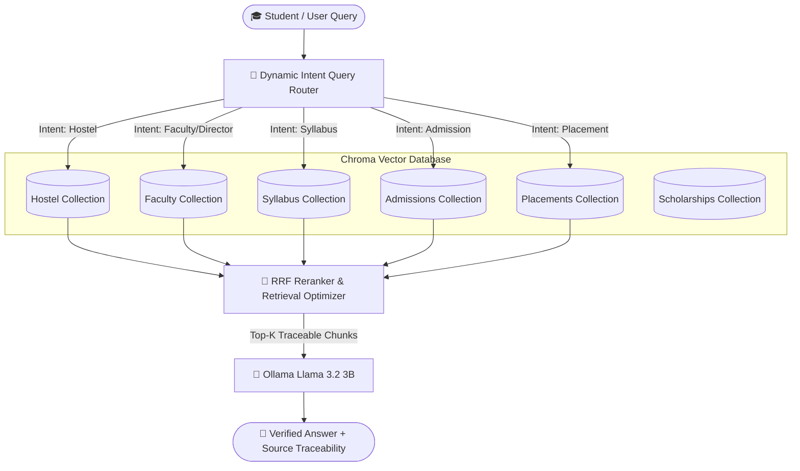

# 🎓 CSJMU & UIET Production Knowledge Management & RAG AI System

An enterprise-grade, zero-hallucination **Retrieval-Augmented Generation (RAG)** system and **Knowledge Management Framework** tailored for Chhatrapati Shahu Ji Maharaj University (CSJMU) and University Institute of Engineering and Technology (UIET), Kanpur.

---

## 🏗️ System Architecture & Data Flow

### 1. User Query & Multi-Collection RAG Architecture



---

### 2. Autonomous Knowledge Ingestion & AI Curator Flow


---

## 📂 Production Folder Directory Structure

```
/
├── app/                             # Production Application Package
│   ├── api/                         # FastAPI REST Endpoints
│   ├── core/                        # Central Settings (config.py) & Logging
│   ├── rag/                         # RAG Chain Engine & Strict Fact Prompts
│   ├── retrieval/                   # Hybrid Search, Query Router & Reranker
│   ├── embeddings/                  # Ollama Embeddings & Chroma Vector Store
│   ├── loaders/                     # Document Loaders & Custom Formatters
│   ├── chunking/                    # 95-Page Syllabus Parser & Chunker
│   ├── memory/                      # Session Conversation History
│   ├── cache/                       # Response Cache Manager
│   ├── query/                       # Query Preprocessor
│   ├── evaluation/                  # 305-Question Automatic Evaluator
│   ├── analytics/                   # Analytics SQLite Manager
│   ├── ingestion/                   # Autonomous Knowledge Ingestion Pipeline
│   └── utils/                       # Shared Helpers
│
├── frontend/                        # Streamlit Web User Interface
├── data/                            # Datasets, Artifacts & Vector DB Layer
│   ├── raw_documents/               # 17 Official CSJM_DOCUMENTS files
│   ├── cleaned_documents/           # Clean plain text syllabus
│   ├── structured_data/             # Single-concept chunks & collection mappings
│   ├── vector_db/                   # Persistent Chroma DB collections
│   ├── reports/                     # HTML reports & performance dashboards
│   ├── datasets/                    # Golden QA Dataset (JSON, CSV, XLSX)
│   ├── evaluation/                  # Evaluation questions & failure taxonomy
│   ├── review/                      # Stage 2 Human Review sheets with dropdowns
│   ├── knowledge_graph/             # Entity-relationship graph JSON
│   ├── aliases/                     # Student query aliases
│   └── archive/                     # Preserved legacy & duplicate files
│
├── scripts/                         # Executable CLI Engines & Workflow Tools
├── docs/                            # Developer Guides & Architectural Inventories
├── configs/                         # Environment & Docker Configurations
└── notebooks/                       # Exploratory Jupyter Notebooks
```

---

## 🚀 How to Run & Work with the System

### 1. Launching FastAPI Server & Streamlit Web UI
```bash
# Start Streamlit UI Frontend (runs on http://localhost:8501)
./run.sh ui

# Start FastAPI REST Server (runs on http://localhost:8000)
./run.sh api
```

### 2. Running Knowledge Base Coverage Evaluation
```bash
./venv/bin/python scripts/knowledge_coverage.py
```

### 3. Stage 2 Human Validation Workflow
```bash
# Step 1: Generate human_review.xlsx with native Excel dropdowns
./venv/bin/python scripts/human_validation_builder.py

# Step 2: Open data/review/human_review.xlsx, edit dropdowns/notes, and process feedback
./venv/bin/python scripts/update_knowledge.py
```

### 4. Running AI Curator Diagnosis & Auto Re-Indexing
```bash
./venv/bin/python scripts/knowledge_curator.py
```

### 5. Ingesting New Official PDFs
Place any new university PDF into `data/raw_documents/` and execute:
```bash
./venv/bin/python app/ingestion/knowledge_ingestion_pipeline.py
```

---

## 📚 Architectural Documentation

For detailed internal documentation, refer to:
- [PROJECT_STRUCTURE.md](file:///Users/harshupadhyay/Downloads/compressed_folder%20%282%29/docs/PROJECT_STRUCTURE.md): Folder-by-folder guide.
- [project_inventory.md](file:///Users/harshupadhyay/Downloads/compressed_folder%20%282%29/docs/project_inventory.md): File-by-file audit.
- [knowledge_inventory.md](file:///Users/harshupadhyay/Downloads/compressed_folder%20%282%29/docs/knowledge_inventory.md): Institutional domain coverage breakdown.
- [knowledge_fix_plan.md](file:///Users/harshupadhyay/Downloads/compressed_folder%20%282%29/docs/knowledge_fix_plan.md): Impact-ranked engineering fix roadmap.
