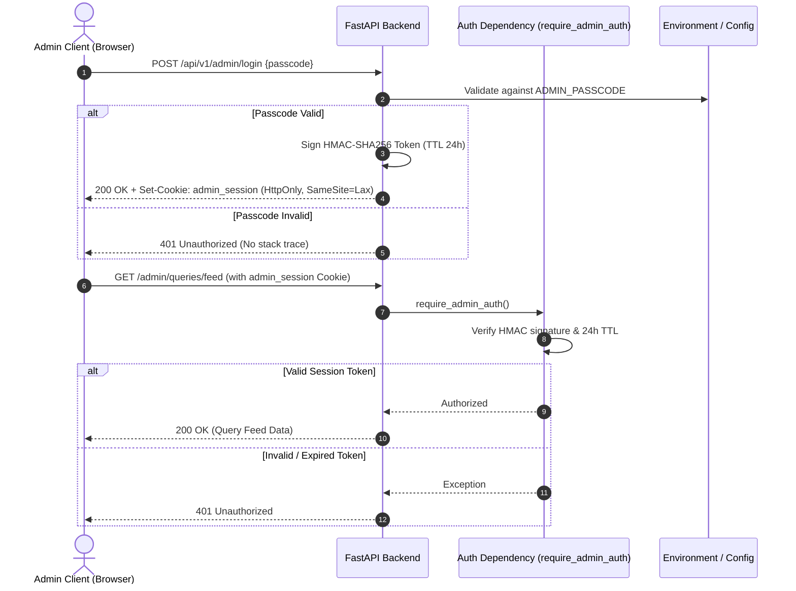
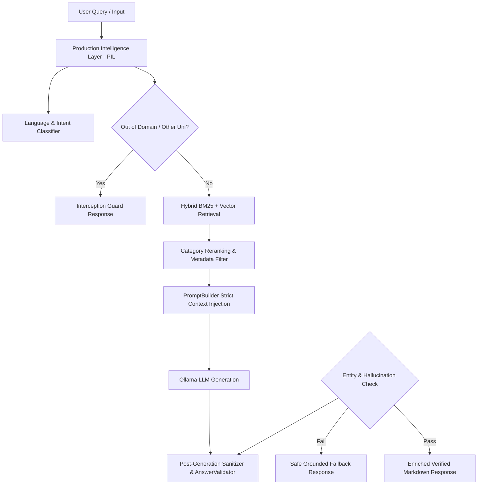

# 🛡️ CSJMU & UIET AI Smart Student Help Desk — Production Security Policy

This document details the security architecture, authentication flow, headers enforcement, session management, RAG safety, knowledge base protection, and vulnerability reporting procedures for the **CSJMU & UIET Kanpur AI Smart Student Help Desk**.

---

## 🏛️ Security Architecture & Threat Model

The application follows a decoupled client-server architecture where public Q&A capabilities are accessible without credentials, while administrative operations (knowledge ingestion, query audits, database rebuilding, analytics) are strictly protected by server-side authentication.

### Architecture Overview

### Threat Model & Countermeasures

| Threat Category | Potential Impact | Mitigation Control in Codebase |
| :--- | :--- | :--- |
| **Credential Leakage** | Unauthorized administrative access | Passcode owned exclusively by backend environment (`ADMIN_PASSCODE`); zero `NEXT_PUBLIC_ADMIN_PASSCODE` in client bundles. |
| **Session Hijacking / XSS** | Theft of admin authentication tokens | Session tokens issued via `HttpOnly`, `SameSite=Lax` cookies signed with HMAC-SHA256 and a 24-hour expiration TTL. |
| **Path Traversal / File Overwrite** | Arbitrary file read/write on host server | `DocumentProcessor.sanitize_filename` strips path separators (`..`, `/`, `\`) and prefixes files with unique UUIDs. |
| **Prompt Injection** | LLM jailbreak / meta-language disclosure | System prompt explicitly forbids meta-language; PIL out-of-domain guard intercepts non-campus queries before LLM invocation. |
| **Hallucination / Misinformation** | Misleading university facts | Grounded context restriction, `AnswerValidator` entity safety check, qualifying language for scholarship figures. |
| **Unbounded File Uploads** | Resource exhaustion / Denial of Service | `DocumentProcessor.validate_file` enforces a 50 MB size cap and file extension whitelist (`.pdf`, `.txt`, `.docx`, `.json`). |
| **CSRF Attacks** | Unauthorized state-changing admin actions | `SameSite=Lax` cookie policy on administrative session tokens. |

---

## 🔒 Security Specifications & Controls

### 1. Zero Frontend Passcode Leakage
- Administrator credentials are owned exclusively by the backend environment (`ADMIN_PASSCODE` in `.env` / `app/core/config.py`).
- **No environment variable starting with `NEXT_PUBLIC_ADMIN_PASSCODE` exists.**
- Passcode is never compiled into Next.js JavaScript bundles, client state (Zustand), `localStorage`, or `sessionStorage`.

### 2. HttpOnly Cookie Session Authentication
- Authenticated administrator sessions are issued via server-side HTTP cookies:
  - **`HttpOnly`**: Prevents client-side JavaScript (`document.cookie`) access, mitigating Cross-Site Scripting (XSS) risks.
  - **`SameSite=Lax`**: Protects against Cross-Site Request Forgery (CSRF).
  - **`Path=/`**: Scoped cookie path.
  - **`Secure`**: Enforced automatically in production HTTPS environments.
- **Cryptographic Token Verification**: Session tokens (`admin:<timestamp>:<signature>`) are signed with **HMAC-SHA256** using `ADMIN_SESSION_SECRET` with a 24-hour expiration TTL.

### 3. HTTP Security Headers
Every HTTP response from the FastAPI backend and Next.js frontend includes mandatory security headers:

| Header Name | Value | Purpose |
| :--- | :--- | :--- |
| `X-Content-Type-Options` | `nosniff` | Blocks MIME-type sniffing attacks. |
| `X-Frame-Options` | `DENY` | Prevents iframe embedding and clickjacking. |
| `Referrer-Policy` | `strict-origin-when-cross-origin` | Restricts referrer leakage across external domains. |
| `Permissions-Policy` | `camera=(), microphone=(), geolocation=(), payment=(), usb=()` | Disables unneeded browser capabilities. |
| `Content-Security-Policy` | `default-src 'self'; img-src 'self' data: blob: https:; style-src 'self' 'unsafe-inline'; font-src 'self' data:; script-src 'self' 'unsafe-inline' 'unsafe-eval'; connect-src 'self' http://localhost:* http://127.0.0.1:*; object-src 'none'; base-uri 'self'; frame-ancestors 'none';` | Restricts script sources, object embedding, and frame ancestors. |
| `Strict-Transport-Security` | `max-age=31536000; includeSubDomains; preload` | Dynamically attached in HTTPS production environments (HSTS). |

---

## 🔑 Session Management

The session management module (`app/api/api.py`) handles administrative authentication lifecycle via HMAC-SHA256 signature verification.

| Lifecycle Phase | Implementation Details |
| :--- | :--- |
| **Token Creation** | Generated in `create_session_token()` using `admin:<timestamp>:<hmac_signature>` signed with `ADMIN_SESSION_SECRET`. |
| **Session Expiration** | Enforces a strict **24-hour TTL** (`86400` seconds). Verified dynamically on every request by checking `time.time() - timestamp > 86400`. |
| **Session Verification** | Handled in `verify_session_token()`. Performs constant-time signature comparison using `hmac.compare_digest()` to prevent timing attacks. |
| **Logout Flow** | Triggered via `POST /api/v1/admin/logout`. Deletes the `admin_session` HttpOnly cookie with `max_age=0`. |

---

## 🚪 API Security

FastAPI endpoints are categorized into public query interfaces and protected administrative routes.

| Endpoint Category | Endpoints | Security Controls |
| :--- | :--- | :--- |
| **Public Endpoints** | `GET /`, `GET /health`, `POST /query`, `POST /query/stream`, `POST /feedback` | Accessible without authentication. Input validated via Pydantic schemas. PIL out-of-domain filtering active. |
| **Protected Admin Endpoints** | `POST /rebuild`, `POST /admin/upload`, `GET /admin/queries/feed`, `GET /admin/analytics`, `GET /admin/documents/uploaded`, `GET /admin/history/{session_id}` | Guarded by `Depends(require_admin_auth)`. Rejects unauthorized requests with HTTP 401. |
| **Auth Middleware** | `require_admin_auth()` | Checks `admin_session` HttpOnly cookie or `Authorization: Bearer <token>` header. |
| **Error Shielding** | `global_exception_handler()` | Intercepts unhandled Python exceptions and returns sanitized JSON error payloads, preventing stack trace disclosure. |

---

## 🧠 RAG Security & Grounding

The Retrieval-Augmented Generation (RAG) pipeline is designed with multi-layered safety controls to maintain data isolation and eliminate hallucinations.

| Security Measure | Implementation Mechanism |
| :--- | :--- |
| **Prompt Injection Mitigation** | `PromptBuilder.build_strict_prompt` explicitly forbids developer meta-terms (`"based on the context"`, `"retrieved documents"`). Instructs LLM to return a standardized fallback when info is missing. |
| **Context Isolation** | Session-isolated memory via `session_id`. RAG context is injected in read-only blocks separated from conversation history. |
| **Knowledge Base Protection** | Local Chroma vector store (`data/vector_db/CHECK_DB`) is isolated from external network access. |
| **Retrieval Validation** | Category routing bonus (+0.4) and keyword overlap scoring in `RetrieverManager` ensure only relevant document chunks enter LLM context. |
| **Source Verification** | Every document chunk carries metadata (`document_id`, `chunk_id`, `checksum`, `doc_type`, `source`). Responses return verifiable source snippets. |
| **Hallucination Reduction** | `AnswerValidator` checks topic relevance and rejects responses containing ungrounded third-party entities (e.g., other universities). |
| **Response Grounding** | Answers are strictly derived from `OFFICIAL KNOWLEDGE BASE`. `sanitize_response` post-processes text to enforce official university terminology. |

---

## 📁 Knowledge Base Security

Document ingestion (`app/ingestion/document_processor.py`) enforces strict validation and sanitization before indexing documents into the knowledge base.

| Mechanism | Implementation Specification |
| :--- | :--- |
| **File Format Whitelist** | Restricts uploads to `.pdf`, `.txt`, `.docx`, and `.json`. All other extensions are rejected immediately. |
| **Size Limit Enforcement** | Caps file uploads at **50 MB** (`MAX_FILE_SIZE_BYTES`). Zero-byte empty files are rejected. |
| **Filename Sanitization** | `DocumentProcessor.sanitize_filename()` strips path separators (`..`, `/`, `\`) and null bytes, neutralizing directory traversal attempts. |
| **Path Traversal Protection** | Uploaded files are stored in `data/uploads/` with a unique UUID prefix: `doc_<uuid>_<sanitized_name>`. |
| **File Deduplication** | Computes SHA-256 checksums (`compute_sha256`) for file contents. Duplicate uploads are detected and blocked before processing. |
| **Incremental Ingestion** | Extracts text safely, generates chunk embeddings, inserts vectors into ChromaDB, updates BM25 sparse index dynamically, and flushes LRU response cache. |

---

## 🤖 AI Safety & Governance

The Production Intelligence Layer (PIL) enforces real-time query classification and post-generation safety checks.

| Governance Feature | Functionality |
| :--- | :--- |
| **Out-of-Domain Detection** | `DomainClassifier.classify_domain()` checks 21 supported domains against `OUT_OF_DOMAIN_PATTERNS` and competitor university names, returning instant guard responses without querying LLM. |
| **Query Normalization** | `QueryNormalizer.normalize()` cleans whitespace and corrects domain typos without injecting unverified entities. |
| **Confidence Scoring** | `RetrieverManager.calculate_confidence()` computes a 0.0–1.0 score based on top-chunk word overlap and document count. |
| **Human Review Workflow** | User ratings (👍 / 👎) logged to SQLite DB. Negative feedback generates tickets in AI Quality Center (`/admin/queries/feed`) for administrator review. |
| **Analytics Logging** | `async_logger` records non-blocking execution traces (query ID, prompt tokens, completion tokens, latency, confidence score) for operational audits. |

---

## 🌐 Infrastructure Security

| Component | Security Configuration |
| :--- | :--- |
| **Docker Deployment** | Multi-container setup (`docker-compose.yml`) running application service on internal ports with environment file bindings (`.env`). |
| **Environment Variables** | Settings managed via Pydantic `BaseSettings` (`app/core/config.py`), reading from root `.env`. |
| **Reverse Proxy & CORS** | Configured with `CORSMiddleware`. Supports dynamic origin evaluation matching local network IPs and production domains. |
| **HTTPS & HSTS** | Automatically enforces `Strict-Transport-Security` (`max-age=31536000; includeSubDomains; preload`) when running in production HTTPS mode. |
| **Secure Cookie Policy** | Admin authentication cookies enforce `HttpOnly`, `SameSite=Lax`, and conditional `Secure` flags. |
| **Content Security Policy** | Enforces strict CSP header restricting scripts, frames (`X-Frame-Options: DENY`), and object sources (`object-src 'none'`). |

---

## 🔐 Secrets Management

- **Environment-Driven Configuration**: All sensitive values (`OPENROUTER_API_KEY`, `ADMIN_PASSCODE`, `ADMIN_SESSION_SECRET`, `OLLAMA_BASE_URL`) are loaded dynamically from environment variables or `.env`.
- **Zero Hardcoded Secrets**: Source code contains zero production credentials, API keys, or private secrets. `OPENROUTER_API_KEY` is read strictly from `os.environ` / `AppConfig` at runtime.
- **Example Credentials**: Default template placeholders appear strictly in `.env.example` for local setup reference.

---

## 📊 Logging, Analytics & Monitoring

| System | Capabilities |
| :--- | :--- |
| **Error Logging** | Centralized logger (`setup_logger`) providing structured console logging. Global exception handler suppresses raw stack traces. |
| **Health Check API** | `GET /health` reports real-time health metrics: FastAPI status, Ollama connectivity, Chroma vector record count, SQLite DB status, and disk free space. |
| **Analytics Database** | Embedded SQLite database (`data/analytics.db`) tracking query history, execution latencies, cache hit rates, and user feedback ratings. |
| **Monitoring Endpoints** | Administrator feeds (`GET /admin/analytics`, `GET /admin/queries/feed`, `GET /admin/documents/uploaded`) provide operational transparency. |
| **Request Isolation Logs** | Structured console output logs Query ID, Normalized Query, Retrieved Chunk IDs, and Prompt preview for auditability. |

---

## 🚀 Deployment Security

| Guideline | Requirement |
| :--- | :--- |
| **Production Mode** | Ensure `ENVIRONMENT=production` in `.env` for production deployments. |
| **Network Isolation** | Public Q&A endpoints are exposed while admin endpoints are restricted behind authentication middleware. |
| **Required Env Variables** | Production deployments require strong values for `ADMIN_PASSCODE`, `ADMIN_SESSION_SECRET`, `OLLAMA_BASE_URL`, and `CORS_ORIGINS`. |

---

## ✅ Current Security Checklist

- [x] **Backend Authentication**: Passcode validation owned exclusively by server.
- [x] **Environment Secrets**: Credentials loaded from `.env` via Pydantic settings.
- [x] **HttpOnly Cookies**: Session cookies inaccessible to client-side JavaScript.
- [x] **HMAC Session Signing**: Session tokens signed with HMAC-SHA256 and 24h TTL.
- [x] **Protected Admin APIs**: Mandatory `require_admin_auth` dependency on admin routes.
- [x] **Security Headers**: `nosniff`, `DENY`, `strict-origin-when-cross-origin`, `Permissions-Policy`.
- [x] **Content Security Policy**: Script, frame, and object source restrictions active.
- [x] **HSTS Enforcement**: Dynamic `Strict-Transport-Security` header in HTTPS mode.
- [x] **Secure CORS**: Restricted origin evaluation supporting production domains.
- [x] **Input Validation**: Strict Pydantic models for incoming API payloads.
- [x] **File Upload Sanitization**: Whitelisted extensions (`.pdf`, `.txt`, `.docx`, `.json`) and 50 MB size limit.
- [x] **Path Traversal Protection**: Filename sanitization and UUID file prefixing.
- [x] **Exception Handling**: Global exception handler masks internal stack traces.
- [x] **Health Monitoring**: `GET /health` evaluates database, vector DB, LLM, and disk status.
- [x] **Analytics Logging**: Async trace logging and SQLite query history tracking.
- [x] **Secure Deployment Configuration**: Docker containerization and HTTPS support.

---

## 🔮 Future Security Improvements

| Feature | Target Milestone | Description |
| :--- | :--- | :--- |
| **Rate Limiting Enforcement** | Phase 3.0 | Redis/Memory sliding window rate limiting on public query endpoints. |
| **CSRF Token Validation** | Phase 3.0 | Explicit CSRF header token validation for state-changing POST endpoints. |
| **Role-Based Access Control (RBAC)**| Phase 3.1 | Multi-tier permissions (Super Admin, Content Manager, Auditor). |
| **Multi-Admin User Support** | Phase 3.1 | Individual admin user accounts with database-backed credentials. |
| **Audit Log Persistence** | Phase 3.2 | Immutable administrative action logging stored in SQLite/PostgreSQL. |
| **Two-Factor Authentication (2FA)** | Phase 3.2 | TOTP / Authenticator app verification for admin login. |
| **Secrets Manager Integration** | Phase 3.3 | AWS Secrets Manager / HashiCorp Vault integration for secret rotation. |
| **API Key Rotation** | Phase 3.3 | Automated background rotation for session signing keys. |
| **Security Event Monitoring** | Phase 3.4 | Real-time alert triggers for repeated failed admin login attempts. |

---

## 📬 Reporting a Vulnerability

If you discover a security vulnerability, please report it responsibly by emailing **security@csjmu.ac.in**.

Please include:
- Description of the vulnerability and potential impact.
- Step-by-step instructions or proof-of-concept script.
- Affected endpoints or components.

We will acknowledge receipt within **24 hours** and provide periodic updates until patched.
